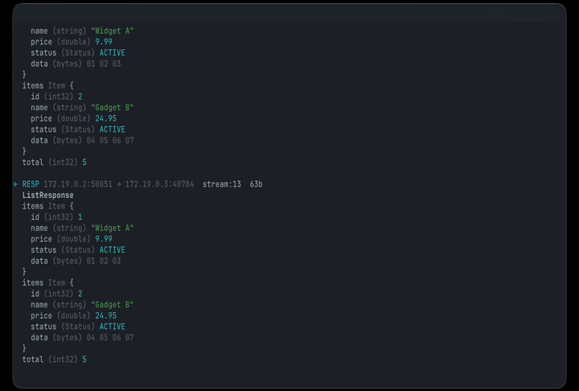

# `grpcsnoop`

> **`tcpdump` for gRPC.** Watch the protobuf messages flowing between services, decoded to readable fields.

<p align="center">
  
  
  
  <a href="https://discord.gg/dYZu9PjKB"></a>
</p>



**`grpcsnoop` turns the plaintext gRPC/protobuf flowing between containers into a live, decoded feed in your terminal.**

> [!TIP]
> **You can't `tcpdump` this.** gRPC is protobuf framed inside HTTP/2: binary, length-prefixed, header-compressed. Unencrypted, it's unreadable on the wire. Encrypted, a packet capture is just ciphertext. `grpcsnoop` hooks the TC layer on the container's veth, reads the plaintext payload with `bpf_skb_load_bytes`, reassembles TCP, and unwinds all three layers.

## Quick start

```sh
curl -fsSL https://yeet.cx | sh
yeet run github:yeet-src/grpcsnoop -- --port 50051
```
<sub>[Manual install guide](https://yeet.cx/docs/installation) | Linux only</sub>

Everything after `--` is passed to grpcsnoop. Useful flags:

- `--port <n>` — the gRPC port to watch (required).
- `--ifindex <n>` — pin to one interface (find it with `ip link`). Default: all interfaces.
- `--hex` — also dump the raw bytes of each message.

Try it against the bundled demo (two containers on a Docker bridge, talking plaintext gRPC):

```sh
git clone https://github.com/yeet-src/grpcsnoop && cd grpcsnoop
bash demo/up.sh
yeet run . --port 50051
bash demo/down.sh
```

## A 60-second primer on gRPC

gRPC looks like one thing but it's three layers stacked, which is why a raw capture is useless:

**1. protobuf — the message.** Your `EchoRequest{ message: "hi", repeat: 3 }` is encoded as a compact binary blob: a sequence of `(field-number, wire-type, value)` tuples. No field names, no types on the wire. `message` becomes "field 1, length-delimited"; `repeat` becomes "field 2, varint". To read it you walk the wire format; to *name* the fields you need the `.proto`.

**2. gRPC framing — the envelope.** Each message gets a 5-byte prefix: 1 compression flag + a 4-byte big-endian length. That's how the receiver knows where one message ends.

**3. HTTP/2 — the transport.** Those framed messages ride inside HTTP/2 `DATA` frames, multiplexed across streams, with request metadata (the `:path` that names the RPC method) in HPACK-compressed `HEADERS` frames. In production, usually wrapped in TLS.

So a `tcpdump` gives you TLS ciphertext (if encrypted) or, at best, opaque HTTP/2 byte soup. `grpcsnoop` captures the plaintext payload and unwinds all three layers.

**Wire types** you'll see in the output:

| Wire type | Used for |
|---|---|
| varint | ints, bools, enums |
| 64-bit | doubles, fixed64 |
| length-delimited | strings, bytes, **nested messages**, packed repeated |
| 32-bit | floats, fixed32 |

## Common use cases

`grpcsnoop` is for developers and SREs debugging gRPC traffic between services they don't fully control on either end.

- A service returns the wrong field. Logs don't show the payload. What's actually on the wire?
- A new client is integrating against an existing service. Is it sending the fields it claims to?
- An undocumented internal gRPC API needs reverse engineering. What does real east-west traffic look like?
- A schema mismatch is suspected. Confirm before blaming the server.

## What you're looking at

Each captured message is one decoded protobuf, tagged with direction and the TCP flow. With a schema (this repo ships one for the demo, see below), you get names, real scalar types, nested messages, and enums:

```
→ REQ  10.89.0.3:43210 → 10.89.0.2:50051  stream:1  20b
  EchoRequest
  message (string) "hello protosnoop"
  repeat (int32) 3
← RESP 10.89.0.2:50051 → 10.89.0.3:43210  stream:7  161b
  ListResponse
  items Item {
    name (string) "Widget A"
    price (double) 9.99
    status (Status) ACTIVE
  }
  ...
```

Without a schema, fields show by number and wire type (`field 1 (string) "…"`).

- **`→ REQ` / `← RESP`** — direction, inferred from which side owns the gRPC port.
- **flow + `stream:N`** — the TCP 4-tuple and HTTP/2 stream id, so you can follow one RPC. A real `stream:N` means the bytes came from an HTTP/2 DATA frame (confirmed gRPC).
- **fields** — protobuf, named via the schema or by number. Nested messages indent. `repeated` fields repeat. Non-UTF-8 bytes fall back to hex. Pass `--hex` to also dump raw bytes.

## How it works

The technical core is in [`grpcsnoop.bpf.c`](grpcsnoop.bpf.c) and [`main.js`](main.js).

### The BPF side

One BPF object attaches two SchedCls programs via `tcx`:

| Program | Hook | What it does |
|---|---|---|
| `on_ingress` | `tcx/ingress` | Read every inbound TCP segment's payload via `bpf_skb_load_bytes` (handles nonlinear skbs, unlike a raw `skb->data` read), filter by port, push the segment + 4-tuple + seq up the ring buffer. |
| `on_egress` | `tcx/egress` | Same, for outbound segments. |

Two maps connect kernel to userspace:

- `events` — `BPF_MAP_TYPE_RINGBUF` (8 MiB), one event per captured segment payload (up to 8 KiB per segment).
- `port_set` — `BPF_MAP_TYPE_HASH` keyed by port, populated from JS at startup. Lets the BPF side cheaply skip non-gRPC traffic.

Both programs return `TCX_NEXT`, so they're passive observers: the packet passes through untouched.

### The JS side

- `main.js` — attaches the TCX programs, writes the target port into `port_set`, subscribes to the ringbuf.
- `tcpstream.js` — TCP reassembly. Orders segments by seq, dedupes copies seen across veths, walks HTTP/2 frames incrementally.
- `proto.js` — protobuf wire decoder. Schema-free (field numbers) or, when `schema.js` is present, named/typed via content-aware best-fit.
- `schema.js` — generated proto schema. Rebuild with `make schema PROTO=yours.proto`.
- `render.js` — ANSI output and the hex dump.

### Why TCX, not a syscall hook

TCX hooks are per-interface, so the same setup catches gRPC across containers without naming a PID or a process. The trade-off is that `grpcsnoop` reassembles the TCP stream in JS (`tcpstream.js`) rather than getting message boundaries from the syscall. For gRPC across container boundaries, that's the right trade.

## Requirements

> [!IMPORTANT]
> Linux kernel **6.6 or newer** for `tcx` attach, with BTF (`CONFIG_DEBUG_INFO_BTF=y`). Default on current Arch, Fedora, Ubuntu 24.04+, and Debian 13+.
>
> The yeet daemon, which handles the privileged BPF load. `curl -fsSL https://yeet.cx | sh` installs it.

## Honest caveats

> [!NOTE]
> What `grpcsnoop` doesn't do, and what it gets wrong.

- **Plaintext only.** If the gRPC channel uses TLS, the TC hook sees ciphertext on the wire. Reading TLS'd gRPC needs an in-process uprobe *before* encryption (a different hook). This tool is for mesh-internal traffic with TLS terminated at the edge, or any east-west path that isn't encrypted.
- **Not loopback.** `bpf_program__attach_tcx` returns `EINVAL` on `lo`, so same-host `localhost` traffic isn't visible. Traffic has to cross a real interface (a container veth, as in the demo).
- **Big or split messages.** TCP segments are reassembled, but gRPC is extracted per HTTP/2 DATA frame, so a single message split across multiple DATA frames is the known gap.
- **No RPC method name.** HPACK header decoding isn't implemented, so the `:path` (e.g. `/svc/Method`) isn't shown. Only the message bodies and (via schema best-fit) the message type.
- **Best-fit ambiguity.** Without the `:path`, the message *type* is inferred by matching field numbers, wire-types, and content. Look-alike messages (e.g. two single-`int32` requests) can still be misattributed.

## Community questions

**Why not just use Wireshark?**
Wireshark has a great gRPC dissector, if you can hand it the TLS keys and the `.proto`. `grpcsnoop` is for the case where you can't: it reads plaintext at the kernel boundary and decodes with one command, no capture file, no app changes.

**Does it work with Go, Rust, or any language?**
Yes. It hooks the kernel, not a library, so it's language-agnostic as long as the traffic is plaintext. This is also why a libssl-uprobe approach doesn't generalize: Go and Rust don't use libssl.

**Will it interfere with the traffic?**
No. The TCX programs return `TCX_NEXT`, so the packet passes through untouched.

**Do I need the `.proto` file?**
No. Without it you get field numbers, wire types, and full structure. With it, you get field names and exact scalar types. Generate a schema module once:

```sh
make schema PROTO=demo/test.proto   # writes schema.js
```

Then `grpcsnoop` imports `schema.js` and decodes against it. The message type isn't on the wire, so it's matched by best-fit; for anything it can't confidently match it falls back to field numbers, so a stale schema degrades gracefully rather than lying.

**How do I scope it to one container?**
By default it attaches to all interfaces and filters by port. To pin it to one container's host-side veth, pass `--ifindex N` (find it with `ip link`).

## The demo

`demo/` runs two containers (a gRPC server and a looping client) on a Docker bridge, the same `veth ↔ bridge` plumbing the TCX hook needs. See [`demo/README.md`](demo/README.md):

```sh
bash demo/up.sh          # build image, start ps-server + ps-client
yeet run . --port 50051  # watch the decoded gRPC (from the repo root)
bash demo/down.sh
```

`testservice/` holds the same `.proto` and app, plus the poetry env `make schema` uses for `grpcio-tools`.

## Building from source

```sh
make          # generates vmlinux.h, builds grpcsnoop.bpf.o
make clean
```

Needs `clang` (BPF target) and `bpftool`. The generated `vmlinux.h` and `*.bpf.o` are gitignored.

## License

[GPL-2.0](LICENSE). The BPF program declares `SEC("license") = "GPL"` in [`grpcsnoop.bpf.c`](grpcsnoop.bpf.c), required for the kernel helpers it uses.

---

Built with [yeet](https://yeet.cx/docs/?utm_source=github&utm_medium=readme&utm_campaign=grpcsnoop), a JS runtime for writing eBPF programs on Linux machines. Join us on [discord](https://discord.gg/dYZu9PjKB?utm_source=github&utm_medium=readme&utm_campaign=grpcsnoop).
